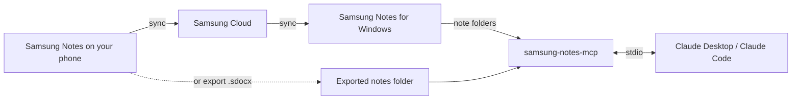

# Samsung Notes for Claude

Let Claude read your Samsung Notes: typed text, tables, handwritten pages, and attached photos and PDFs such as invoices and receipts. Ask things like “Put every invoice from 2026 in a spreadsheet” or “What did I write about the kitchen?”

It is **read-only**: it never changes, moves or deletes a note. Unofficial; not affiliated with Samsung.

## Install with your AI agent

Copy this into Claude Code, Claude Desktop's Code tab, or any agent that can run commands on your computer:

```text
Install "Samsung Notes Reader" for me: a read-only MCP server that lets Claude read my Samsung Notes (https://github.com/Mhemd139/Samsung_Notes). Do the steps yourself; only ask me for the clicks you can't do.

1. Ask me where I want it: Claude Desktop (recommended), Claude Code, or both.
2. Claude Desktop: if it isn't installed, send me to https://claude.ai/download first. Download https://github.com/Mhemd139/Samsung_Notes/releases/latest/download/samsung-notes-mcp.mcpb into my Downloads folder and open it the way a double-click would (Windows PowerShell: Invoke-Item "<file>"; macOS: open -a Claude "<file>"). Then tell me:
   - if Windows asks which app opens .mcpb files, choose Claude and Always;
   - a red "not verified by Anthropic" banner is normal; click Install, then Install again in the dialog;
   - if Claude doesn't open the file: Settings → Extensions → Advanced settings → Install Extension…, and pick the file.
   Don't edit claude_desktop_config.json; the extension sets itself up.
3. Claude Code: check node -v is 20.12 or newer. Clone the repo into a folder that will stay (not a temp folder), run npm ci and npm run build there, then run: claude mcp add --scope user samsung-notes -- node "<absolute path>/dist/index.js"
4. My notes: if I use Samsung Notes for Windows, there's nothing to set. Otherwise help me export them from my phone (Samsung Notes → select notes → Share → Samsung Notes file) into one folder on this computer. For Claude Desktop, I choose that folder as "Exported notes folder" in the extension's settings; for Claude Code, add --exports "<folder>" at the end of the claude mcp add command.
5. Finish by telling me to start a new chat and ask: "Give me an overview of my notes."
```

Or install it yourself:

## Install (Claude Desktop)

1. **[Download samsung-notes-mcp.mcpb](https://github.com/Mhemd139/Samsung_Notes/releases/latest/download/samsung-notes-mcp.mcpb)** and open it. Claude Desktop shows the extension: click **Install**, then **Install** again in the dialog. Nothing else to install; Claude Desktop includes Node.js.
   - Windows may ask which app opens `.mcpb` files: choose **Claude** and **Always**.
   - Claude shows a red banner saying the developer isn't verified by Anthropic. That's normal for any extension outside Anthropic's directory; all the code is in this repository.
   - If opening the file doesn't reach Claude: in Claude Desktop, go to **Settings → Extensions → Advanced settings → Install Extension…** and choose the file.
2. Where are your notes?
   - **Samsung Notes for Windows** (Galaxy Book, or any PC where it runs): nothing to set. Open Samsung Notes once and sign in so your notes sync.
   - **Everything else (Mac, other PCs)**: on your phone, open Samsung Notes, select notes → **Share** → **Samsung Notes file**, and save the `.sdocx` files into one folder on your computer (Google Drive, OneDrive, USB — any way works). In Claude Desktop, open the extension's settings and choose that folder as **Exported notes folder**. Put new exports in the same folder any time; Claude sees them on the next question.
3. Start a new chat and ask about your notes.

## Claude Code

Until the npm package is published, run it from a copy of this repository (needs Node.js 20.12 or newer):

```bash
git clone https://github.com/Mhemd139/Samsung_Notes.git
cd Samsung_Notes
npm ci
npm run build
claude mcp add --scope user samsung-notes -- node "$PWD/dist/index.js"
```

`--scope user` makes it work in every folder, not only this one. With exported notes, add `--exports "/path/to/folder"` at the end of the last command.

## Try asking

- “Give me an overview of my notes.”
- “Find every invoice from this year and make a table: vendor, date, total, note.”
- “Read my handwritten notes from last week and summarise them.”
- “What's in the PDF attached to my ‘Car insurance’ note?”

## What Claude can do

| Tool | What it does |
|---|---|
| `notes_overview` | Where notes come from, folders, totals, problems |
| `list_notes` | Browse or search by words, folder, date, attachments or handwriting |
| `read_note` | A note's typed text, tables, attachment list, and which pages hold handwriting |
| `get_page_image` | A page as an image — this is how Claude reads handwriting |
| `get_attachment` | An attached photo, or a PDF's text and page images |

## Privacy policy

- Your notes are read on your computer. There is no server, no account and no analytics, and the extension makes no network requests.
- It never changes, moves or deletes a note, and keeps no copies of them.
- When Claude opens a note, page or attachment during a chat, that content is sent to Claude as part of the chat, like anything you paste, under [Anthropic's privacy policy](https://www.anthropic.com/legal/privacy). Nothing else leaves your computer.
- Questions: [open an issue](https://github.com/Mhemd139/Samsung_Notes/issues).

## Limits

- Handwriting is read from page images, so search finds typed text and titles only.
- Locked notes stay locked. Unlock them in Samsung Notes to include them.
- Extremely long notes (over 250,000 characters) can't be read yet.
- Page images show bold text at normal weight.
- The Windows source reads Samsung Notes' own files; a Samsung Notes update could change them. If that happens, `notes_overview` says so.

## Troubleshooting

- **“No Samsung Notes found”**: see step 2 of Install.
- **“No notes yet” or “Folder not found”**: let Samsung Notes finish syncing, or create the folder. No restart needed; Claude sees the notes on the next question.
- **A note is missing**: notes in the recycle bin are skipped. New notes appear on the next question — no restart needed.
- **Ask Claude to run `notes_overview`**: it lists every problem it found.

## How it works



## Development

```bash
npm install
npm test
npm run build
npm run pack:mcpb   # one-click bundle for all platforms
npm run smoke       # local check against your own notes; prints counts only
```

## Credits and license

- Parser: [twangodev/sdocx](https://github.com/twangodev/sdocx) (GPL-3.0).
- PDF engine: [PDFium](https://pdfium.googlesource.com/pdfium/) via [@hyzyla/pdfium](https://github.com/hyzyla/pdfium).
- Test notes: [SDOCX Compatibility Corpus](https://huggingface.co/datasets/twangodev/sdocx-compatibility) (CC BY 4.0).

GPL-3.0-only. See [LICENSE](LICENSE).
