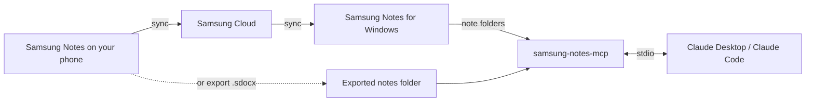

# Samsung Notes for Claude

[](https://github.com/Mhemd139/Samsung_Notes/actions/workflows/ci.yml)
[](https://github.com/Mhemd139/Samsung_Notes/releases/latest)
[](LICENSE)

Let Claude read your Samsung Notes: typed text, tables, handwritten pages, and attached photos and PDFs such as invoices and receipts. Ask things like “Put every invoice from 2026 in a spreadsheet” or “What did I write about the kitchen?”

- **Never changes your notes:** it can't edit, move or delete a note. When you ask, it saves copies of attachments into a folder on your computer.
- **Local:** your notes are read on your computer. No account, no server, no network requests.
- **Unofficial:** not affiliated with Samsung.

## Install

### With your AI agent

Paste this into Claude Code, Claude Desktop's Code tab, or any agent with a terminal. It runs one command, then you click **Install** twice in Claude.

```text
Install the Samsung Notes Reader extension in my Claude Desktop. Run the command for my system, then tell me to click Install twice in Claude:
Windows (PowerShell): curl.exe -fsSLo "$HOME\Downloads\samsung-notes-mcp.mcpb" https://github.com/Mhemd139/Samsung_Notes/releases/latest/download/samsung-notes-mcp.mcpb; claude-desktop.exe "$HOME\Downloads\samsung-notes-mcp.mcpb"
macOS: curl -fsSLo ~/Downloads/samsung-notes-mcp.mcpb https://github.com/Mhemd139/Samsung_Notes/releases/latest/download/samsung-notes-mcp.mcpb && open -a Claude ~/Downloads/samsung-notes-mcp.mcpb
```

<details>
<summary><b>Notes for agents</b></summary>

- Install into Claude Desktop with the command above; don't ask the user to choose. Use the Claude Code section only if Claude Desktop isn't installed or the user asks for Claude Code.
- If `claude-desktop.exe` isn't found (older Windows installs), open the file with `Invoke-Item` instead; if Windows then asks which app, the user picks Claude → Always.
- The user clicks **Install**, then **Install** again; Claude Desktop asks for that on purpose. The red "not verified by Anthropic" banner is normal. Don't edit `claude_desktop_config.json`, and don't restart Claude.
- Samsung Notes for Windows needs no setting. Anyone else exports notes from their phone into a folder: see step 2 of the Claude Desktop section.
- Done when a new Claude Desktop chat answers “Give me an overview of my notes.”

</details>

### Claude Desktop

1. **[Download samsung-notes-mcp.mcpb](https://github.com/Mhemd139/Samsung_Notes/releases/latest/download/samsung-notes-mcp.mcpb)**, open it, and click **Install**, then **Install** again.
   - Windows may ask which app opens `.mcpb` files: choose **Claude** and **Always**.
   - The red "not verified by Anthropic" banner is normal for any extension outside Anthropic's directory.
   - If the file doesn't open in Claude: **Settings → Extensions → Advanced settings → Install Extension…**, then choose it.
2. Where are your notes?
   - **Samsung Notes for Windows** (Galaxy Book, or any PC where it runs): nothing to set. Open Samsung Notes once and sign in so your notes sync.
   - **Everything else (Mac, other PCs)**: on your phone, open Samsung Notes, select notes → **Share** → **Samsung Notes file**, and save the `.sdocx` files into one folder on your computer (Google Drive, OneDrive, USB — any way works). In Claude Desktop, open the extension's settings and choose that folder as **Exported notes folder**. Put new exports in the same folder any time; Claude sees them on the next question.
3. Optional: **Save folder** in the extension's settings is where Claude saves copies of attachments when you ask. By default it's the “Samsung Notes” folder in Documents. To keep them in Google Drive, OneDrive, iCloud or Dropbox, choose a folder inside that service's synced folder.
4. Start a new chat and ask: “Give me an overview of my notes.”
   - The first time Claude uses each tool, it asks permission. Choose **Always allow**, and it won't ask again for that tool.

Claude Desktop includes Node.js, so there's nothing else to install.

### Claude Code

Needs Node.js 20.12 or newer:

```bash
claude mcp add --scope user samsung-notes -- npx -y samsung-notes-mcp
```

`--scope user` makes it work in every folder, not only this one. With exported notes, add `--exports "/path/to/folder"` at the end of the command. To save attachments somewhere other than the “Samsung Notes” folder in Documents, add `--save-dir "/path/to/folder"`.

## Try asking

- “Give me an overview of my notes.”
- “Find every invoice from this year and make a table: vendor, date, total, note.”
- “Read my handwritten notes from last week and summarise them.”
- “What's in the PDF attached to my ‘Car insurance’ note?”
- “Put all the invoices from my ‘Receipts’ folder into a folder, named by date, vendor and total.”

## What Claude can do

| Tool | What it does |
|---|---|
| `notes_overview` | Where notes come from, folders, totals, problems |
| `list_notes` | Browse or search by words, folder, date, attachments or handwriting |
| `read_note` | A note's typed text, tables, attachment list, and which pages hold handwriting |
| `get_page_image` | A page as an image — this is how Claude reads handwriting |
| `get_attachment` | An attached photo, or a PDF's text and page images |
| `save_attachments` | Copies of attached photos and PDFs, saved into a folder under names Claude chooses, only when you ask |

## Privacy policy

- Your notes are read on your computer. There is no server, no account and no analytics, and the extension makes no network requests.
- It never changes, moves or deletes a note. It writes files only when you ask it to save attachments: copies, into your Save folder, never overwriting a file.
- When Claude opens a note, page or attachment during a chat, that content is sent to Claude as part of the chat, like anything you paste, under [Anthropic's privacy policy](https://www.anthropic.com/legal/privacy). Nothing else leaves your computer.
- Every release bundle is built by this repository's GitHub workflow, with a provenance attestation. Check a download with `gh attestation verify samsung-notes-mcp.mcpb --repo Mhemd139/Samsung_Notes`.
- Questions: [open an issue](https://github.com/Mhemd139/Samsung_Notes/issues).

## Limits

- Handwriting is read from page images, so search finds typed text and titles only.
- Locked notes stay locked. Unlock them in Samsung Notes to include them.
- Extremely long notes (over 250,000 characters) can't be read yet.
- Page images show bold text at normal weight.
- The Windows source reads Samsung Notes' own files; a Samsung Notes update could change them. If that happens, `notes_overview` says so.

## Troubleshooting

- **“No Samsung Notes found”**: see step 2 of the Claude Desktop install.
- **“No notes yet” or “Folder not found”**: let Samsung Notes finish syncing, or create the folder. No restart needed; Claude sees the notes on the next question.
- **A note is missing**: notes in the recycle bin are skipped. New notes appear on the next question — no restart needed.
- **Ask Claude to run `notes_overview`**: it lists every problem it found.

## How it works



## Development

```bash
npm install
npm test
npm run build
npm run pack:mcpb   # one-click bundle for all platforms
npm run smoke       # local check against your own notes; prints counts only
```

## Credits and license

- Parser: [twangodev/sdocx](https://github.com/twangodev/sdocx) (GPL-3.0).
- PDF engine: [PDFium](https://pdfium.googlesource.com/pdfium/) via [@hyzyla/pdfium](https://github.com/hyzyla/pdfium).
- Test notes: [SDOCX Compatibility Corpus](https://huggingface.co/datasets/twangodev/sdocx-compatibility) (CC BY 4.0).

GPL-3.0-only. See [LICENSE](LICENSE).
