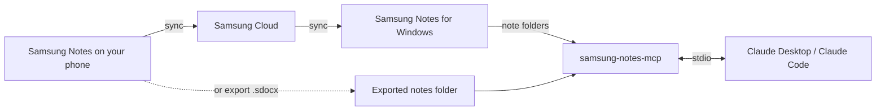

# Samsung Notes for Claude

[](https://github.com/Mhemd139/Samsung_Notes/actions/workflows/ci.yml)
[](https://github.com/Mhemd139/Samsung_Notes/releases/latest)
[](LICENSE)

Let Claude read your Samsung Notes: typed text, tables, handwritten pages, and attached photos and PDFs such as invoices and receipts. Ask things like “Put every invoice from 2026 in a spreadsheet” or “What did I write about the kitchen?”

- **Read-only:** it never changes, moves or deletes a note.
- **Local:** your notes are read on your computer. No account, no server, no network requests.
- **Unofficial:** not affiliated with Samsung.

## Install

### With your AI agent

Paste this into Claude Code, Claude Desktop's Code tab, or any agent that can run commands on your computer. Giving your agent the link to this page works too.

```text
Install Samsung Notes Reader for me from https://github.com/Mhemd139/Samsung_Notes
Follow the "Notes for agents" in its README: run what you can yourself, and tell me exactly what to click for the rest.
```

<details>
<summary><b>Notes for agents</b></summary>

- Don't ask which app. If Claude Desktop is installed, use the Claude Desktop section: its chats and its Code tab both get the tools. Use the Claude Code section only if Claude Desktop isn't installed, or the user asks for Claude Code in a terminal or IDE.
- Claude Desktop: download the bundle yourself, then open it the way a double-click would (Windows PowerShell: `Invoke-Item "<file>"`; macOS: `open -a Claude "<file>"`). The user clicks **Install** twice; Claude Desktop asks for that on purpose. Don't edit `claude_desktop_config.json`: the extension sets itself up and needs no restart.
- Optional check that the bundle was built from this repository by its release workflow: `gh attestation verify samsung-notes-mcp.mcpb --repo Mhemd139/Samsung_Notes`. Skip it if `gh` isn't installed or signed in. If it runs and fails, stop and tell the user.
- Claude Code: run the commands in a folder that will stay, not a temp folder.
- Where the notes are: with Samsung Notes for Windows, nothing to set. Otherwise guide the user through step 2 of the Claude Desktop section; phone exports need their hands.
- Done when `claude mcp list` shows `samsung-notes` as connected (Claude Code), or a new Claude Desktop chat answers “Give me an overview of my notes.”

</details>

### Claude Desktop

1. **[Download samsung-notes-mcp.mcpb](https://github.com/Mhemd139/Samsung_Notes/releases/latest/download/samsung-notes-mcp.mcpb)** and open it.
   - Windows may ask which app opens `.mcpb` files: choose **Claude** and **Always**.
   - Claude Desktop shows the extension with a red banner saying the developer isn't verified by Anthropic. That's normal for any extension outside Anthropic's directory. Click **Install**, then **Install** again in the dialog.
   - If opening the file doesn't reach Claude: **Settings → Extensions → Advanced settings → Install Extension…**, then choose the file.
2. Where are your notes?
   - **Samsung Notes for Windows** (Galaxy Book, or any PC where it runs): nothing to set. Open Samsung Notes once and sign in so your notes sync.
   - **Everything else (Mac, other PCs)**: on your phone, open Samsung Notes, select notes → **Share** → **Samsung Notes file**, and save the `.sdocx` files into one folder on your computer (Google Drive, OneDrive, USB — any way works). In Claude Desktop, open the extension's settings and choose that folder as **Exported notes folder**. Put new exports in the same folder any time; Claude sees them on the next question.
3. Start a new chat and ask: “Give me an overview of my notes.”

Claude Desktop includes Node.js, so there's nothing else to install.

### Claude Code

Until the npm package is published, run it from a copy of this repository (needs git and Node.js 20.12 or newer):

```bash
git clone https://github.com/Mhemd139/Samsung_Notes.git
cd Samsung_Notes
npm ci
npm run build
claude mcp add --scope user samsung-notes -- node "$PWD/dist/index.js"
```

`--scope user` makes it work in every folder, not only this one. With exported notes, add `--exports "/path/to/folder"` at the end of the last command.

## Try asking

- “Give me an overview of my notes.”
- “Find every invoice from this year and make a table: vendor, date, total, note.”
- “Read my handwritten notes from last week and summarise them.”
- “What's in the PDF attached to my ‘Car insurance’ note?”

## What Claude can do

| Tool | What it does |
|---|---|
| `notes_overview` | Where notes come from, folders, totals, problems |
| `list_notes` | Browse or search by words, folder, date, attachments or handwriting |
| `read_note` | A note's typed text, tables, attachment list, and which pages hold handwriting |
| `get_page_image` | A page as an image — this is how Claude reads handwriting |
| `get_attachment` | An attached photo, or a PDF's text and page images |

## Privacy policy

- Your notes are read on your computer. There is no server, no account and no analytics, and the extension makes no network requests.
- It never changes, moves or deletes a note, and keeps no copies of them.
- When Claude opens a note, page or attachment during a chat, that content is sent to Claude as part of the chat, like anything you paste, under [Anthropic's privacy policy](https://www.anthropic.com/legal/privacy). Nothing else leaves your computer.
- Questions: [open an issue](https://github.com/Mhemd139/Samsung_Notes/issues).

## Limits

- Handwriting is read from page images, so search finds typed text and titles only.
- Locked notes stay locked. Unlock them in Samsung Notes to include them.
- Extremely long notes (over 250,000 characters) can't be read yet.
- Page images show bold text at normal weight.
- The Windows source reads Samsung Notes' own files; a Samsung Notes update could change them. If that happens, `notes_overview` says so.

## Troubleshooting

- **“No Samsung Notes found”**: see step 2 of the Claude Desktop install.
- **“No notes yet” or “Folder not found”**: let Samsung Notes finish syncing, or create the folder. No restart needed; Claude sees the notes on the next question.
- **A note is missing**: notes in the recycle bin are skipped. New notes appear on the next question — no restart needed.
- **Ask Claude to run `notes_overview`**: it lists every problem it found.

## How it works



## Development

```bash
npm install
npm test
npm run build
npm run pack:mcpb   # one-click bundle for all platforms
npm run smoke       # local check against your own notes; prints counts only
```

## Credits and license

- Parser: [twangodev/sdocx](https://github.com/twangodev/sdocx) (GPL-3.0).
- PDF engine: [PDFium](https://pdfium.googlesource.com/pdfium/) via [@hyzyla/pdfium](https://github.com/hyzyla/pdfium).
- Test notes: [SDOCX Compatibility Corpus](https://huggingface.co/datasets/twangodev/sdocx-compatibility) (CC BY 4.0).

GPL-3.0-only. See [LICENSE](LICENSE).
