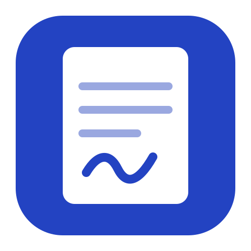
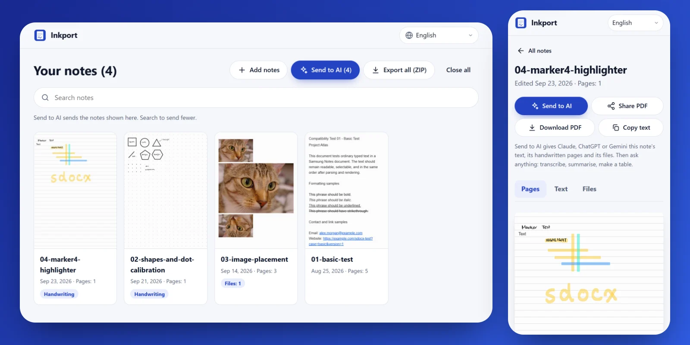
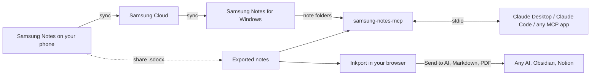

<p align="center">
  
</p>

<h1 align="center">Samsung Notes, anywhere</h1>

<p align="center">
  Open your Samsung Notes on any device, take them with you, and let AI read them.<br>
  Free and open source. Your notes stay on your device.
</p>

<p align="center">
  <a href="https://mhemd139.github.io/Samsung_Notes/"><b>Open Inkport in your browser</b></a>
  &nbsp;·&nbsp;
  <a href="#connect-your-notes-to-claude"><b>Connect your notes to Claude</b></a>
</p>

<p align="center">
  <a href="https://github.com/Mhemd139/Samsung_Notes/actions/workflows/ci.yml"></a>
  <a href="https://github.com/Mhemd139/Samsung_Notes/releases/latest"></a>
  <a href="https://www.npmjs.com/package/samsung-notes-mcp"></a>
  <a href="LICENSE"></a>
</p>

<picture>
  <source media="(prefers-color-scheme: dark)" srcset="assets/inkport-dark.webp">
  
</picture>

## Inkport: your notes in any browser

Samsung Notes files (`.sdocx`) only open on Samsung devices. [Inkport](https://mhemd139.github.io/Samsung_Notes/) opens them on iPhone, Mac, Windows, Linux, Chromebook and Android.

- **Every page, as you wrote it:** handwriting, drawings, typed text, tables, photos, PDFs and voice recordings.
- **Take everything with you:** one ZIP with Markdown and a PDF for every note, original dates kept, ready for Obsidian, Notion or any folder.
- **Send to AI in one tap:** Claude, ChatGPT or Gemini gets the typed text as a text file, the handwritten pages as images, and every attached photo and PDF. Then ask it to transcribe, summarise or build a table. On a phone it opens the share menu; on a computer it saves the files to drag into the chat. One message holds at most 10 files, so big batches put the page images in one PDF.
- **Private and free:** it runs in your browser and sends your files nowhere. Its security policy blocks background requests to other sites. No account, no usage limits, works offline, in 21 languages.

**Get your notes out of Samsung Notes:** long-press a note and select the ones you want, then **Share** → **Samsung Notes file**. On Android, install Inkport from Chrome's menu and pick it in that share menu; then **Send to AI** passes the notes on to your AI app. Anywhere else, save the files (Google Drive, OneDrive, a USB stick, an email to yourself) and open them in Inkport.

## Connect your notes to Claude

The connector lets Claude read your whole Samsung Notes library on your computer: search notes, read handwriting from page images, open invoice photos and PDFs, and save renamed copies into folders. It never changes a note.

| You use | Install |
|---|---|
| **Claude Desktop** | **[Download samsung-notes-mcp.mcpb](https://github.com/Mhemd139/Samsung_Notes/releases/latest/download/samsung-notes-mcp.mcpb)**, open it, and click **Install**, then **Install** again. |
| **Claude Code** | `/plugin install samsung-notes --marketplace Mhemd139/Samsung_Notes` |
| **VS Code** | **[Install in VS Code](https://vscode.dev/redirect/mcp/install?name=samsung-notes&config=%7B%22command%22%3A%22npx%22%2C%22args%22%3A%5B%22-y%22%2C%22samsung-notes-mcp%22%5D%7D)** |
| **Codex CLI** | `codex mcp add samsung-notes -- npx -y samsung-notes-mcp` |
| **Gemini CLI** | `gemini mcp add samsung-notes npx -y samsung-notes-mcp` |
| **Cursor, Windsurf and others** | Add `{"mcpServers": {"samsung-notes": {"command": "npx", "args": ["-y", "samsung-notes-mcp"]}}}` to the app's MCP settings. |

Claude Desktop includes everything it needs; the others need [Node.js](https://nodejs.org) 20.12 or newer.

**Where your notes come from:**

- **Samsung Notes for Windows** (it installs on any PC): nothing to set. Open it once, sign in and let your notes sync.
- **Everything else (Mac, Linux):** export notes from your phone as shown above, into one folder. In Claude Desktop, choose that folder as **Exported notes folder** in the extension's settings. Elsewhere, add `--exports "/path/to/folder"` to the command. Put new exports in the same folder any time; Claude sees them on the next question.

<details>
<summary><b>Install with your AI agent</b></summary>

Paste this into Claude Code, Claude Desktop's Code tab, or any agent with a terminal. It runs one command, then you click **Install** twice in Claude.

```text
Install the Samsung Notes Reader extension in my Claude Desktop. Run the command for my system, then tell me to click Install twice in Claude:
Windows (PowerShell): curl.exe -fsSLo "$HOME\Downloads\samsung-notes-mcp.mcpb" https://github.com/Mhemd139/Samsung_Notes/releases/latest/download/samsung-notes-mcp.mcpb; claude-desktop.exe "$HOME\Downloads\samsung-notes-mcp.mcpb"
macOS: curl -fsSLo ~/Downloads/samsung-notes-mcp.mcpb https://github.com/Mhemd139/Samsung_Notes/releases/latest/download/samsung-notes-mcp.mcpb && open -a Claude ~/Downloads/samsung-notes-mcp.mcpb
```

Notes for agents:

- Install into Claude Desktop with the command above; don't ask the user to choose. Use the Claude Code line only if Claude Desktop isn't installed or the user asks for Claude Code.
- If `claude-desktop.exe` isn't found (older Windows installs), open the file with `Invoke-Item` instead; if Windows then asks which app, the user picks Claude → Always.
- The user clicks **Install**, then **Install** again; Claude Desktop asks for that on purpose. The red "not verified by Anthropic" banner is normal. Don't edit `claude_desktop_config.json`, and don't restart Claude.
- Samsung Notes for Windows needs no setting. Anyone else exports notes from their phone into a folder (see "Where your notes come from").
- Done when a new Claude Desktop chat answers “Give me an overview of my notes.”

</details>

<details>
<summary><b>Claude Desktop, step by step</b></summary>

1. Download the `.mcpb` file above, open it, and click **Install**, then **Install** again.
   - Windows may ask which app opens `.mcpb` files: choose **Claude** and **Always**.
   - The red "not verified by Anthropic" banner is normal for any extension outside Anthropic's directory.
   - If the file doesn't open in Claude: **Settings → Extensions → Advanced settings → Install Extension…**, then choose it.
2. Optional: **Save folder** in the extension's settings is where Claude saves copies of attachments when you ask. By default it's the “Samsung Notes” folder in Documents. To keep them in Google Drive, OneDrive, iCloud or Dropbox, choose a folder inside that service's synced folder.
3. Start a new chat and ask: “Give me an overview of my notes.” The first time Claude uses each tool, it asks permission. Choose **Always allow**, and it won't ask again for that tool.

In Claude Code, `claude mcp add --scope user samsung-notes -- npx -y samsung-notes-mcp` also works without the plugin. Add `--exports "/path/to/folder"` for exported notes, or `--save-dir "/path/to/folder"` to save attachments somewhere other than Documents.

</details>

### Try asking

- “Give me an overview of my notes.”
- “Find every invoice from this year and make a table: vendor, date, total, note.”
- “Read my handwritten notes from last week and summarise them.”
- “What's in the PDF attached to my ‘Car insurance’ note?”
- “Put all the invoices from my ‘Receipts’ folder into a folder, named by date, vendor and total.”

### What Claude can do

| Tool | What it does |
|---|---|
| `notes_overview` | Where notes come from, folders, totals, problems |
| `list_notes` | Browse or search by words, folder, date, attachments or handwriting |
| `read_note` | A note's typed text, tables, attachment list, and which pages hold handwriting |
| `get_page_image` | A page as an image — this is how Claude reads handwriting |
| `get_attachment` | An attached photo, or a PDF's text and page images |
| `save_attachments` | Copies of attached photos and PDFs, saved into a folder under names Claude chooses, only when you ask |

## Privacy

- **Inkport** runs in your browser. Your files are read on your device and never uploaded, and the page has no analytics or cookies. Its Content Security Policy blocks background requests to any other site. GitHub Pages serves the app's own files, so GitHub may log visits to the page like any website ([GitHub's privacy statement](https://docs.github.com/en/site-policy/privacy-policies/github-general-privacy-statement)).
- **The connector** reads your notes on your computer. There is no server, no account and no analytics, and it makes no network requests.
- Neither tool changes, moves or deletes a note. The connector writes files only when you ask it to save attachments: copies, into your Save folder, never overwriting a file.
- When Claude opens a note, page or attachment during a chat, that content is sent to Claude as part of the chat, like anything you paste, under [Anthropic's privacy policy](https://www.anthropic.com/legal/privacy). The same goes for any AI you send notes to from Inkport.
- Every connector release bundle is built by this repository's GitHub workflow, with a provenance attestation. Check a download with `gh attestation verify samsung-notes-mcp.mcpb --repo Mhemd139/Samsung_Notes`.
- Questions: [open an issue](https://github.com/Mhemd139/Samsung_Notes/issues).

## Limits

- Handwriting is read from page images, so search finds typed text and titles only.
- Inkport's PDFs are images of each page, so their text can't be selected; the Markdown file next to each PDF carries the typed text.
- Inkport builds an export in memory. On a phone, export a few hundred notes at a time.
- Locked notes stay locked. Unlock them in Samsung Notes to include them.
- Extremely long notes (over 250,000 characters) can't be read yet.
- Page images show bold text at normal weight.
- The Windows source reads Samsung Notes' own files; a Samsung Notes update could change them. If that happens, `notes_overview` says so.

## Troubleshooting

- **“No Samsung Notes found”**: see "Where your notes come from".
- **“No notes yet” or “Folder not found”**: let Samsung Notes finish syncing, or create the folder. No restart needed; Claude sees the notes on the next question.
- **A note is missing**: notes in the recycle bin are skipped. New notes appear on the next question — no restart needed.
- **Ask Claude to run `notes_overview`**: it lists every problem it found.
- **Something else**: [report a problem](https://github.com/Mhemd139/Samsung_Notes/issues/new/choose). Please don't attach your real notes; issues are public.

## How it works



## Development

```bash
npm install
npm test
npm run build
npm run web:dev     # Inkport on http://localhost:5173
npm run pack:mcpb   # one-click bundle for all platforms
npm run smoke       # local check against your own notes; prints counts only
```

Translations live in [`web/src/locales`](web/src/locales); a native speaker's fix is the most welcome contribution there is. See [CONTRIBUTING.md](CONTRIBUTING.md) for the project layout and rules, [CHANGELOG.md](CHANGELOG.md) for what changed, and [SECURITY.md](SECURITY.md) to report a vulnerability privately.

## Credits and license

- Parser: [twangodev/sdocx](https://github.com/twangodev/sdocx) (GPL-3.0). To inspect a file's internals, try its own viewer at [sdocx.twango.dev](https://sdocx.twango.dev).
- PDF engine: [PDFium](https://pdfium.googlesource.com/pdfium/) via [@hyzyla/pdfium](https://github.com/hyzyla/pdfium).
- Test notes: [SDOCX Compatibility Corpus](https://huggingface.co/datasets/twangodev/sdocx-compatibility) (CC BY 4.0).
- Unofficial: not affiliated with Samsung. Samsung Notes is a trademark of Samsung Electronics.

GPL-3.0-only. See [LICENSE](LICENSE).
